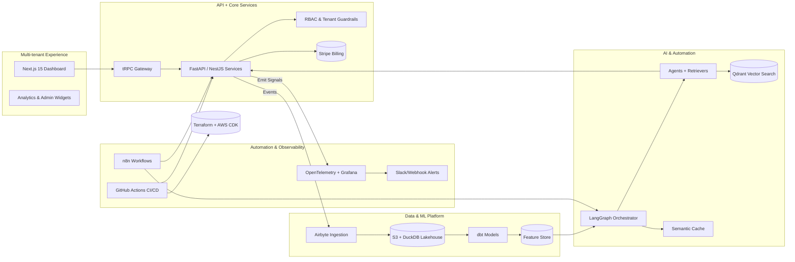

# Atlas — AI-Native Product Platform Boilerplate

> A reference implementation that demonstrates how a senior engineering leader designs, orchestrates, and operates a multi-tenant, AI-native SaaS platform end to end.

## Why Atlas

Atlas acts as a public artifact of technical, product, and operational leadership. It shows how to connect AI services, data foundations, secure multi-tenant core services, and DevOps automation into a single, shippable vision. Each module is intentionally documented so reviewers can infer architecture decisions, trade-offs, and the maturity of the organization behind it.

### What this repo demonstrates
- **Technical depth** — layered architecture, IaC, AI orchestration, observability, and automated workflows.
- **Strategic thinking** — product personas, cost modeling, ADRs, and variants for different go-to-market stories.
- **Execution maturity** — opinionated folder structure, stubbed CI/CD pipeline, and documentation scaffolding for demos, runbooks, and governance.

## Architecture at a Glance



## Layered Stack

| Layer | Primary Tech | Purpose |
| --- | --- | --- |
| Frontend | Next.js 15, Tailwind, tRPC | Multi-tenant dashboards, chat/agent console, admin tooling |
| Core Services | FastAPI (or NestJS), PostgreSQL, Redis, Stripe | Users, RBAC, billing, tenancy isolation, event sourcing |
| AI Services | LangGraph, OpenAI/Anthropic, Qdrant, semantic cache | Agent workflows, retrieval, safety rails, evaluation |
| Data Platform | Airbyte, DuckDB, dbt, S3 | Controlled ingestion, transformations, feature pipelines, analytics |
| Infra & Ops | AWS CDK, Terraform, ECS/Fargate, Docker, OpenTelemetry, Grafana, Loki | Provisioning, deployment, tracing, dashboards |
| Automation | GitHub Actions, n8n, Slack webhooks | CI/CD, incident playbooks, human-in-the-loop routing |

## Modules

| Path | Focus |
| --- | --- |
| `core/` | Auth (JWT), tenant isolation, billing, RBAC policies, API contracts. |
| `ai/` | LangGraph agents, prompt kits, semantic caching, retrieval pipelines. |
| `data/` | ETL jobs, dbt models, analytics marts, feature store guidelines. |
| `infra/` | Terraform + CDK stacks, observability blueprints, deployment targets. |
| `automation/` | CI/CD workflows, n8n recipes, operational runbooks. |
| `docs/` | ADRs, diagrams, AI integration notes, product strategy, personas, demo notes. |

Each directory ships with a README that calls out scope, open questions, and next tasks so the project feels like a living internal platform.

## Leadership Signals Captured Here
- **System design narrative** — `docs/ADRs` plus `ARCHITECTURE.md` describe the layered stack and trade-offs.
- **Product thinking** — `docs/product/strategy.md` and personas connect the tech to value props.
- **Execution rigor** — `.github/workflows/ci.yml`, `automation/` playbooks, and `COST.md` highlight operational accountability.
- **Scalability mindset** — multi-tenant core, AI service isolation, observability (`core/api/app/telemetry.py`, `infra/observability/`) and governance baked into the tree.

## Quick Start (scaffold phase)
1. Clone the repo and install the `docs` tooling prerequisites listed in `ARCHITECTURE.md` (PlantUML/Mermaid preview, mkdocs optional). Set `ATLAS_DATABASE_URL` (e.g. `sqlite:///atlas.db` locally or the Postgres DSN from Docker Compose) before starting the FastAPI service.
2. Apply migrations once with `alembic upgrade head` (or `docker compose run core-api alembic upgrade head` inside containers) so the `tenant`/`usage` tables exist.
3. Pick a vertical (Fintech, SaaS Copilot, Platform) and capture the first ADR describing the business scenario.
4. Flesh out one slice per layer: e.g., build the `core/auth` FastAPI module, wire `ai/agents` to Qdrant, or author infra stacks.
5. Keep product + ops docs in sync by updating `ROADMAP.md` and `docs/product/strategy.md` as you go.
6. To spin up the stack quickly, run `docker compose up --build` (core API, frontend, Postgres, Qdrant) or import the Postman collection in `docs/api/` to smoke-test endpoints.
   - Protected endpoints require a JWT. Export `CORE_API_BEARER_TOKEN=$(curl -s -X POST http://localhost:8000/auth/token -H 'Content-Type: application/json' -d '{"username":"admin@atlas","password":"atlas"}' | jq -r .access_token)` before starting the frontend (same value is used by `docker compose` if set).

### Authentication & Webhooks
- `POST /auth/token` issues a JWT (defaults: `admin@atlas` / `atlas`). Use `Authorization: Bearer <token>` for protected operations such as `POST /tenants` and `POST /tenants/{id}/usage`.
- `POST /webhooks/stripe` validates the `Stripe-Signature` header (configured via `ATLAS_STRIPE_WEBHOOK_SECRET`) so you can simulate billing events during demos.
- `POST /metrics/usage` + `GET /metrics/usage/daily` capture AI usage events (tokens, latency) for the last 24h. The AI orchestrator posts here automatically when `ATLAS_AI_CORE_API_TOKEN` is set.
- Set `ATLAS_OTLP_ENDPOINT` (core API) and `ATLAS_AI_OTLP_ENDPOINT` (LangGraph) to stream traces/metrics to your collector (OTLP/HTTP by default). A sample collector config lives in `infra/observability/otel-collector.yaml`.
- Frontend server actions use `CORE_API_URL`/`CORE_API_BEARER_TOKEN` to authenticate when calling protected endpoints (`/tenants`, `/metrics/usage`).

## CI Pipeline
- `.github/workflows/ci.yml` runs ruff + pytest (core API & AI), builds the Next.js frontend, and enforces `terraform fmt/validate`. Keep it green by running the same commands locally:
  ```bash
  cd core/api && ruff check app && ATLAS_DATABASE_URL=sqlite:// pytest
  cd ai && PYTHONPATH=.. pytest
  cd frontend && npm ci && npm run build
  terraform fmt -check -recursive && (cd infra/terraform && terraform init -backend=false && terraform validate)
  ```

## Included Scaffolds
- `core/api` — FastAPI service with tenant-aware dependencies (`uvicorn app.main:app`).
- `frontend/` — Next.js 15 canary dashboard with server actions that call FastAPI to simulate usage + fetch billing previews.
- `ai/` — LangGraph orchestrator + Qdrant client stubs with a runnable HITL simulation.
- `automation/` — CI workflows, n8n recipes, and on-call playbooks (Slack HITL + cost anomaly runbooks).

## Repository Layout

```
.
├── README.md
├── ARCHITECTURE.md
├── COST.md
├── ROADMAP.md
├── DEMO.md
├── core/
├── ai/
├── data/
├── infra/
├── automation/
├── docs/
└── .github/
```

See each subdirectory README for detailed guidance.

## Variants You Can Pitch
1. **Atlas Fintech** — add real-time ledger, PCI controls, and AI risk scoring flows.
2. **Atlas SaaS Copilot** — position as a knowledge assistant + workflow automation layer for GTM teams.
3. **Atlas Platform** — highlight API-first design, marketplace extensions, SLAs, and tenant partitioning.

Document the chosen variant in `docs/product/strategy.md` and reference it from ADRs so reviewers see your strategic lens.

## Next Steps
- Build end-to-end demo scripts in `DEMO.md` + screenshots/GIFs.
- Expand CI/CD workflow to lint, test, and deploy core + infra modules.
- Wire cost guardrails in `COST.md` and link to observability dashboards.
- Publish a Loom walkthrough tying the architecture back to personas and outcomes.

---

Atlas is intentionally modular; treat it like an internal accelerator you would hand to a platform or applied AI team.
